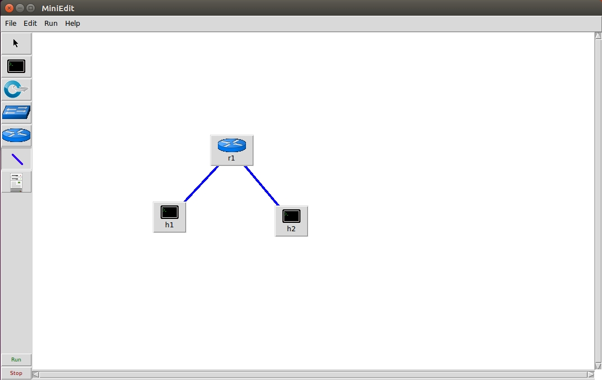
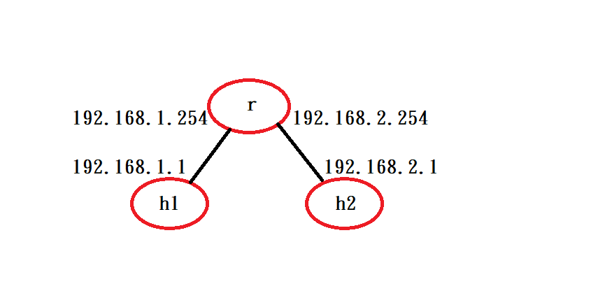
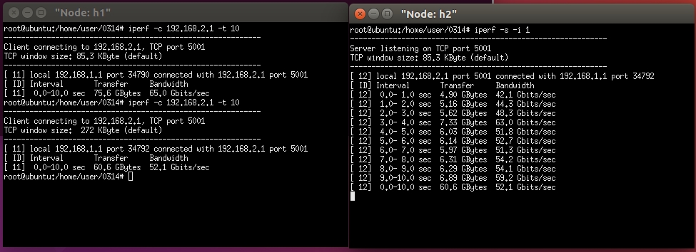
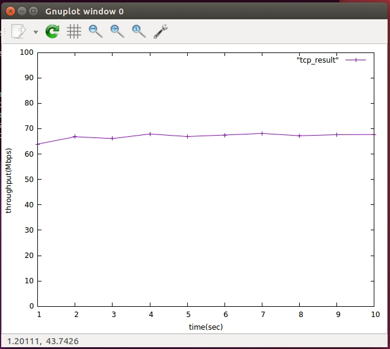
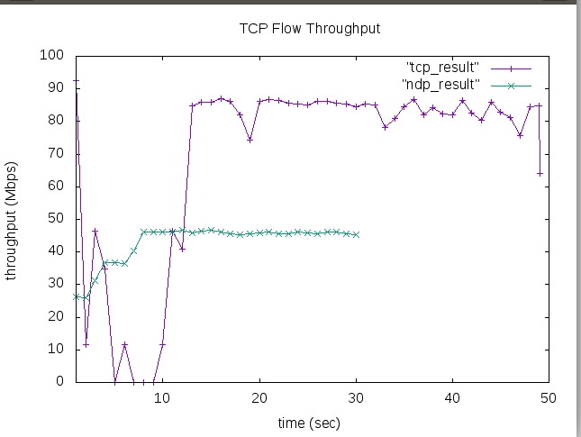
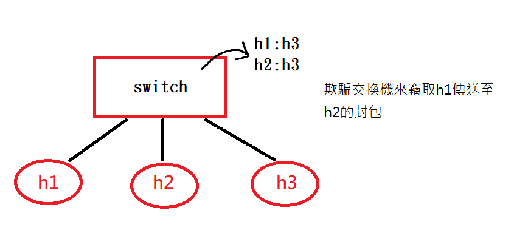
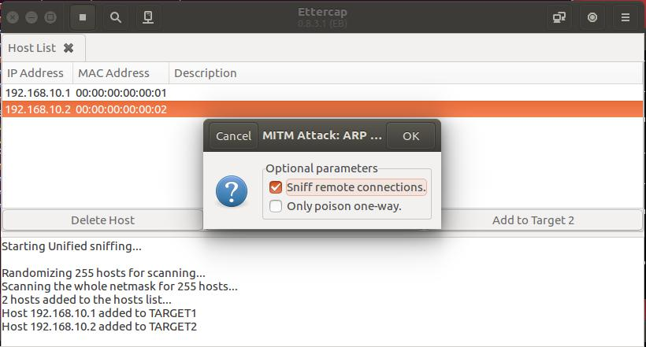
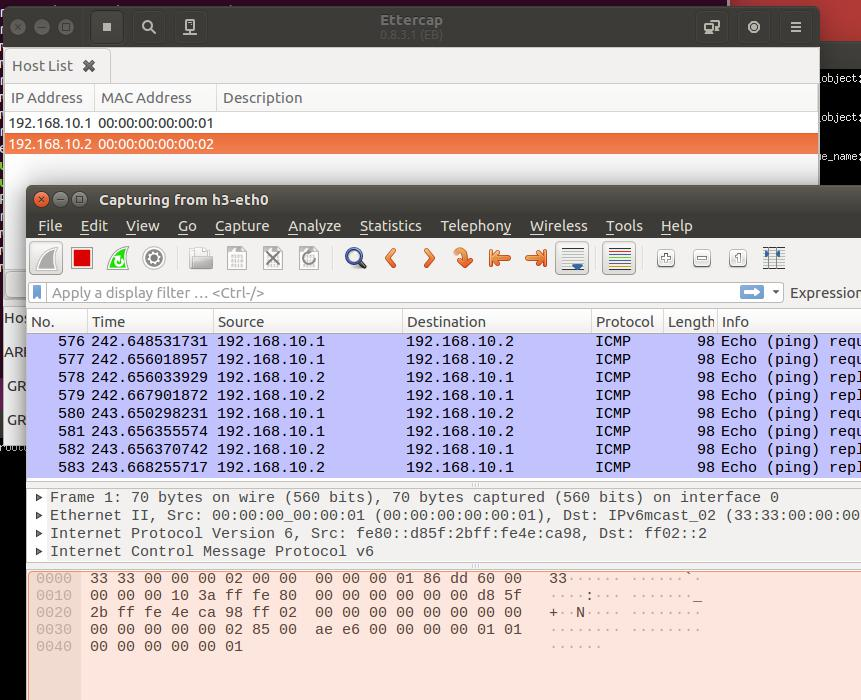

# 0314 第五週筆記

## 利用圖形化的工具架構網路
### 範例一
```
# cd mininet/examples
# ./miniedit.py
```



可利用file>export將設好的環境輸出

## 效能量測工具iperf
* 安裝iperf
```
# apt install iperf
```

### 範例一



* 2.py
```
#!/usr/bin/python

from mininet.cli import CLI
from mininet.net import Mininet
from mininet.link import Link,TCLink,Intf

if '__main__'==__name__:
  net=Mininet(link=TCLink)
  h1=net.addHost('h1')
  h2=net.addHost('h2')
  r=net.addHost('r')

  #設定頻寬、延遲、遺失率
  #h1r = {'bw':100,'delay':'1ms','loss':0}  
  #net.addLink(h1, r, cls=TCLink , **h1r)
  #h2r = {'bw':100,'delay':'1ms','loss':0}
  #net.addLink(h2, r, cls=TCLink , **h2r)

  Link(h1,r)
  Link(h2,r)
  net.build()

  h1.cmd("ifconfig h1-eth0 0")
  h1.cmd("ip a a 192.168.1.1/24 brd + dev h1-eth0")
  h1.cmd("ip route add default via 192.168.1.254")
  h2.cmd("ifconfig h2-eth0 0")
  h2.cmd("ip a a 192.168.2.1/24 brd + dev h2-eth0")
  h2.cmd("ip route add default via 192.168.2.254")

  r.cmd("ifconfig r-eth0 0")
  r.cmd("ifconfig r-eth1 0")
  r.cmd("ip a a 192.168.1.254/24 brd + dev r-eth0")
  r.cmd("ip a a 192.168.2.254/24 brd + dev r-eth1")
  r.cmd("echo 1 > /proc/sys/net/ipv4/ip_forward")
  CLI(net)
  net.stop()
```
* 執行過程
```
# ./2.py
mininet> xterm h1 h2
h2> iperf -s -i 1  #-s:server -i 1:每一秒偵測一次
h1> iperf -c 192.168.2.1 -t 10  #-t 10:傳送10秒，若未指定以TCP傳送
```


* 透過不同埠號來監測限制後的速度
```
# ./2.py
mininet> xterm h1 h2 h1 h2
h2> iperf -s -i 1 -u  #-u:以UDP傳送
h1> iperf -c 192.168.2.1 -u -b 100M -t 100  #-b 100M:將速度限制在100M
h2> iperf -s -i 1 -u -p 5555  #-u:以UDP傳送 -p 5555:傳送到埠號5555的伺服器
h1> iperf -c 192.168.2.1 -u -b 200M -t 100 -p 5555
```


## 透過gnuplot將數據轉成圖表

### 範例一
```
# ./2py
mininet> xterm h1 h2
h2> iperf -s -i 1 | tee result  #tee:將結果同時輸出到螢幕和檔案
h1> iperf -c 192.168.2.1 -t 10
h2> cat result | grep "sec" | head -n 10 | tr "-" " " | awk '{print $4,$8}' > tcp_result
```
* gnuplot
```
# apt install gnuplot
# gnuplot 
gnuplot> plot "tcp_result" with linespoints  #用點線繪製
gnuplot> set xlabel "time (sec)"
gnuplot> set ylabel "throughput (Mbps)"
gnuplot> set xrange [1:10]
gnuplot> set xtics 0,1,10
gnuplot> set yrange [0:100]
gnuplot> set ytics 0,10,100
gnuplot> set title "TCP Flow Throughput"
gnuplot> set terminal gif  #設定繪製格式
gnuplot> set output "tcp_udp.gif"  #設定輸出檔名
gnuplot> replot  #重新繪製圖表
```


### 範例二-輸出圖表觀察tcp和udp互相影響的情形
* 3.py
```
#!/usr/bin/python

from mininet.cli import CLI
from mininet.net import Mininet
from mininet.link import Link,TCLink,Intf

if '__main__'==__name__:
  net=Mininet(link=TCLink)
  h1=net.addHost('h1')
  h2=net.addHost('h2')
  r=net.addHost('r')
  h1r = {'bw':100,'delay':'1ms','loss':0}
  net.addLink(h1, r, cls=TCLink , **h1r)
  h2r = {'bw':100,'delay':'1ms','loss':0}
  net.addLink(h2, r, cls=TCLink , **h2r)
  Link(h1,r)
  Link(h2,r)
  net.build()

  h1.cmd("ifconfig h1-eth0 0")
  h1.cmd("ip a a 192.168.1.1/24 brd + dev h1-eth0")
  h1.cmd("ip route add default via 192.168.1.254")
  h2.cmd("ifconfig h2-eth0 0")
  h2.cmd("ip a a 192.168.2.1/24 brd + dev h2-eth0")
  h2.cmd("ip route add default via 192.168.2.254")

  r.cmd("ifconfig r-eth0 0")
  r.cmd("ifconfig r-eth1 0")
  r.cmd("ip a a 192.168.1.254/24 brd + dev r-eth0")
  r.cmd("ip a a 192.168.2.254/24 brd + dev r-eth1")
  r.cmd("echo 1 > /proc/sys/net/ipv4/ip_forward")
  CLI(net)
  net.stop()
```
* 執行指令
```
# ./3py
mininet> xterm h1 h2 h1 h2
h2(1)> iperf -s -i 1 -p 5555 | tee tcp
h2(2)> iperf -s -i 1 -u -p 6666 | tee udp
h1(2)> iperf -c 192.168.2.1 -u -b 50M -t 30 -p 6666
h1(1)> iperf -c 192.168.2.1 -t 50 -p 5555
h2(1)> cat tcp | grep "sec" |head -n 50 | tr "-" " " | awk '{print $4,$8}' > tcp_result
h2(2)> cat udp | grep "sec" | grep -v out-of-order | tr "-" " " | head -n 30 | awk '{print $4,$8}' > udp_result
```

* 將指令寫成腳本輸出圖表-plot.plt
```
plot "result" with linespoints
set xlabel "time (sec)"
set ylabel "throughput (Mbps)"
set xrange [1:10]
set xtics 0,1,10
set yrange [0:100]
set ytics 0,10,100
set title "TCP Flow Throughput"
set terminal gif
set output "result.gif"
replot
```
* 輸出指令
```
# gnuplot plot.plt
```


## ettercap 圖形化介面

### 安裝ettercap
```
# apt install cmake -y
# apt-get install debhelper bison check cmake flex ghostscript libbsd-dev libcurl4-openssl-dev libgeoip-dev libltdl-dev libluajit-5.1-dev libncurses5-dev libnet1-dev libpcap-dev libpcre3-dev libssl-dev libgtk-3-dev libgtk2.0-dev -y
# wget https://github.com/Ettercap/ettercap/archive/v0.8.3.1.tar.gz
# tar vfxz v0.8.3.1.tar.gz
# cd ettercap-0.8.3.1/
# mkdir build
# cd build
# cmake ../
# make install
```
### 範例一-arp poisoning(可透過綁定靜態arp防範)

* 4.py
```
#!/usr/bin/python

from mininet.cli import CLI
from mininet.net import Mininet
from mininet.link import Link,TCLink,Intf

if '__main__'==__name__:
  net=Mininet(link=TCLink)
  h1=net.addHost('h1')
  h2=net.addHost('h2')
  h3=net.addHost('h3')
  br=net.addHost('br')
  Link(h1,br)
  Link(h2,br)
  Link(h3,br)
  net.build()
  h1.cmd("ifconfig h1-eth0 0")
  h2.cmd("ifconfig h2-eth0 0")
  h3.cmd("ifconfig h3-eth0 0")
  h1.cmd("ifconfig br-eth0 0")
  h2.cmd("ifconfig br-eth1 0")
  h3.cmd("ifconfig br-eth2 0")
  br.cmd("brctl addbr mybr")
  br.cmd("brctl addif mybr br-eth0")
  br.cmd("brctl addif mybr br-eth1")
  br.cmd("brctl addif mybr br-eth2")
  br.cmd("ifconfig mybr up")

  h1.cmd("ip a a 192.168.10.1/24 dev h1-eth0")
  h2.cmd("ip a a 192.168.10.2/24 dev h2-eth0")
  h3.cmd("ip a a 192.168.10.3/24 dev h3-eth0")
  h1.cmd("ifconfig h1-eth0 hw ether 00:00:00:00:00:01")
  h2.cmd("ifconfig h2-eth0 hw ether 00:00:00:00:00:02")
  h3.cmd("ifconfig h3-eth0 hw ether 00:00:00:00:00:03")
  CLI(net)
  net.stop()
```

* 指令
```
# ./4.py
mininet> xterm h1 h2 h3 h3
h3> wireshark
h1> ping 192.168.10.2
h3> ettercap -G
```
1. 打勾後先掃描連接的主機


2. 查看host lists，並設定攻擊目標


3. 開始arp poisoning



### 範例二-透過欺騙交換機來竊取封包-port stealing(若是先設好靜態arp也無效)

* 指令
```
# ./4.py
mininet> xterm h1 h2 h3 h3
h3> wireshark
h1> ping 10.0.0.2
h3> ettercap -G
```
1. 執行port stealing


2. 執行結果



