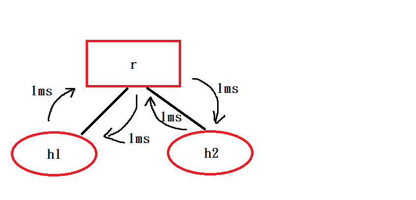
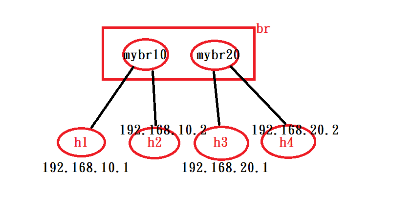
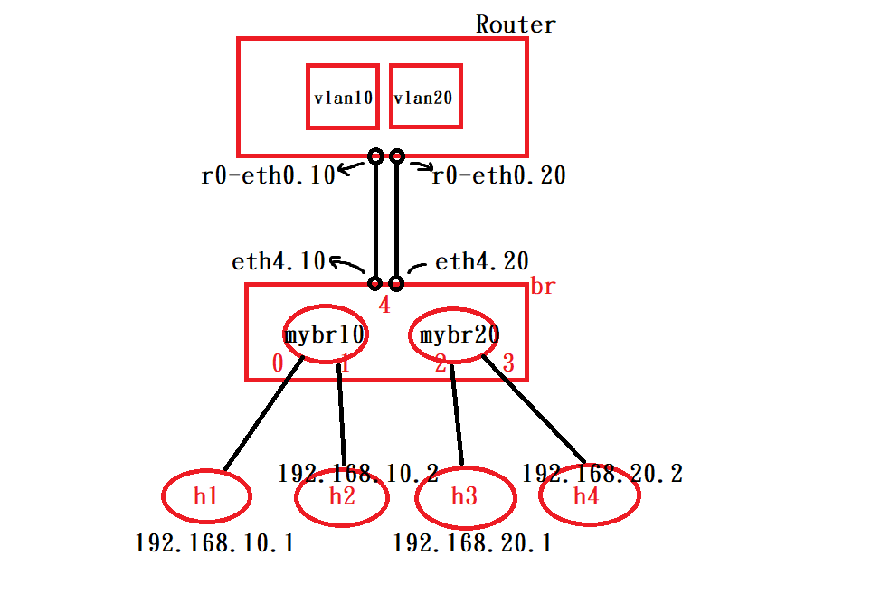

# 0321 第六週筆記

## 網路傳遞過程中延遲的原因
### 範例一-更改遺失率來觀察封包送達情況




* 3.py
```
#!/usr/bin/python

from mininet.cli import CLI
from mininet.net import Mininet
from mininet.link import Link,TCLink,Intf

if '__main__'==__name__:
  net=Mininet(link=TCLink)
  h1=net.addHost('h1')
  h2=net.addHost('h2')
  r=net.addHost('r')
  h1r = {'bw':100,'delay':'1ms','loss':10}  ## delay:延遲時間 loss:遺失率
  net.addLink(h1, r, cls=TCLink , **h1r)
  h2r = {'bw':100,'delay':'1ms','loss':0}
  net.addLink(h2, r, cls=TCLink , **h2r)
  Link(h1,r)
  Link(h2,r)
  net.build()

  h1.cmd("ifconfig h1-eth0 0")
  h1.cmd("ip a a 192.168.1.1/24 brd + dev h1-eth0")
  h1.cmd("ip route add default via 192.168.1.254")
  h2.cmd("ifconfig h2-eth0 0")
  h2.cmd("ip a a 192.168.2.1/24 brd + dev h2-eth0")
  h2.cmd("ip route add default via 192.168.2.254")

  r.cmd("ifconfig r-eth0 0")
  r.cmd("ifconfig r-eth1 0")
  r.cmd("ip a a 192.168.1.254/24 brd + dev r-eth0")
  r.cmd("ip a a 192.168.2.254/24 brd + dev r-eth1")
  r.cmd("echo 1 > /proc/sys/net/ipv4/ip_forward")
  CLI(net)
  net.stop()
```

* 測試指令
```
h1> ping -i 0.01 -c 1000 192.168.2.1  ##-i:每0.01秒傳送一次(本來預設是1秒)
```


loss = (1-0.1) x 1 x 1 x(1-0.1)=0.81

## 動態繪製實時網速
```
# sed -i '/^$/d' process.sh  ##刪除空白行
```
* 3-1.py
```
#!/usr/bin/python

from mininet.cli import CLI
from mininet.net import Mininet
from mininet.link import Link,TCLink,Intf

if '__main__'==__name__:
  net=Mininet(link=TCLink)
  h1=net.addHost('h1')
  h2=net.addHost('h2')
  r=net.addHost('r')
  h1r = {'bw':100,'delay':'1ms','loss':0}  ## delay:延遲時間 loss:遺失率
  net.addLink(h1, r, cls=TCLink , **h1r)
  h2r = {'bw':100,'delay':'1ms','loss':0}
  net.addLink(h2, r, cls=TCLink , **h2r)
  Link(h1,r)
  Link(h2,r)
  net.build()

  h1.cmd("ifconfig h1-eth0 0")
  h1.cmd("ip a a 192.168.1.1/24 brd + dev h1-eth0")
  h1.cmd("ip route add default via 192.168.1.254")
  h2.cmd("ifconfig h2-eth0 0")
  h2.cmd("ip a a 192.168.2.1/24 brd + dev h2-eth0")
  h2.cmd("ip route add default via 192.168.2.254")

  r.cmd("ifconfig r-eth0 0")
  r.cmd("ifconfig r-eth1 0")
  r.cmd("ip a a 192.168.1.254/24 brd + dev r-eth0")
  r.cmd("ip a a 192.168.2.254/24 brd + dev r-eth1")
  r.cmd("echo 1 > /proc/sys/net/ipv4/ip_forward")
  CLI(net)
  net.stop()
```
* process.sh: 讀取每一行並過濾出所需資訊
```
filename='a'
> result
> a
b="not"
while true
do
   if [ -s "$filename" ]
   then
        #echo "$filename is NOT empty file."
        while IFS= read -r line
        do
          result=`echo "$line" | grep "sec"`
          if [[ -n $result ]]
          then
            #echo $result
            b="done"
            break
          fi
        done < a
   fi
 
   if [ $b = "done" ]
   then
     break
   fi
done
 
while IFS= read -r line
do
  result=`echo "$line" | grep "sec" | tr "-" " " | awk '{print $4,$8}'`
  if [[ -n $result ]]
  then
    echo $result
    echo $result >> result
    sleep 1
  fi
done < a
```
* gnuplot-plot
```
FILE = 'result'
stop = 0
 
N = 10
set yrange [0:100]
set ytics 0,10,100
set key off
set xlabel "time(sec)"
set ylabel "Throughput(Mbps)"
 
while (!stop) {  
    pause 0.1       # pause in seconds
    stats [*:*][*:*] FILE u 0 nooutput
    lPnts=STATS_records<N ? 0: STATS_records-N
    plot FILE u 1:2 every ::lPnts w lp pt 7
}
```
* plot-throughput.sh
```
filename='result'
while true
do
   if [ -s "$filename" ]
   then
        #echo "$filename is NOT empty file."
        break
   fi
done
 
gnuplot gnuplot-plot
```
* 執行指令
```
# ./3-1.py
mininet> xterm h1 h2 h2 h2
h2(1)> ./process.sh
h2(2)> ./plot-throughput.sh
h2(3)> iperf -s -i 1 > a
h1> iperf -c 192.168.2.1 -t 1000
```

## 載入新kernal、新模組的方法
```
# modprobe 8021q
# cd /
# mdir data
# cd data
# wget https://cdn.kernel.org/pub/linux/kernel/v5.x/linux-5.15.31.tar.xz
# apt-get install gcc make libncurses5-dev openssl libssl-dev build-essential pkg-config libc6-dev bison flex libelf-dev -y
# tar xfJ linux-5.15.31.tar.xz
# uname -r  ##查看所使用的核心
# cd linux-5.15.31
# cd arch  ##linux所支援的不同架構
# cd .. fs  ##檔案系統
# cd .. mm  ##memory management
# cd ..
# cp /boot/config-4.15.0-142-generic .config
# make menuconfig
# make  ##更改完後重新make
``` 


## vlan應用
### 範例一



* test2.py
```
from mininet.net import Mininet
from mininet.link import Link,TCLink,Intf

if 'main' == name:
  net = Mininet(link=TCLink)
  h1 = net.addHost('h1')
  h2 = net.addHost('h2')
  h3 = net.addHost('h3')
  h4 = net.addHost('h4')
  br1 = net.addHost('br1')
  net.addLink(h1, br1)
  net.addLink(h2, br1)
  net.addLink(h3, br1)
  net.addLink(h4, br1)
  net.build()
  h1.cmd("ifconfig h1-eth0 0")
  h2.cmd("ifconfig h2-eth0 0")
  h3.cmd("ifconfig h3-eth0 0")
  h3.cmd("ifconfig h4-eth0 0")
  br1.cmd("ifconfig br1-eth0 0")
  br1.cmd("ifconfig br1-eth1 0")
  br1.cmd("ifconfig br1-eth2 0")
  br1.cmd("ifconfig br1-eth3 0")
  br1.cmd("brctl addbr mybr10")
  br1.cmd("brctl addbr mybr20")
  br1.cmd("brctl addif mybr10 br1-eth0")
  br1.cmd("brctl addif mybr10 br1-eth1")
  br1.cmd("brctl addif mybr20 br1-eth2")
  br1.cmd("brctl addif mybr20 br1-eth3")
  br1.cmd("ifconfig mybr10 up")
  br1.cmd("ifconfig mybr20 up")
  h1.cmd("ip address add 192.168.10.1/24 dev h1-eth0")
  h2.cmd("ip address add 192.168.10.2/24 dev h2-eth0")
  h3.cmd("ip address add 192.168.20.1/24 dev h3-eth0")
  h4.cmd("ip address add 192.168.20.2/24 dev h4-eth0")
  CLI(net)
  net.stop()
```

### 範例二



* test3.py
```
#! /usr/bin/env python
from mininet.cli import CLI
from mininet.net import Mininet
from mininet.link import Link,TCLink,Intf

if 'main' == name:
  net = Mininet(link=TCLink)
  h1 = net.addHost('h1')
  h2 = net.addHost('h2')
  h3 = net.addHost('h3')
  h4 = net.addHost('h4')
  br1 = net.addHost('br1')
  r1 = net.addHost('r1')
  net.addLink(h1, br1)
  net.addLink(h2, br1)
  net.addLink(h3, br1)
  net.addLink(h4, br1)
  net.addLink(br1,r1)
  net.build()
  h1.cmd("ifconfig h1-eth0 0")
  h2.cmd("ifconfig h2-eth0 0")
  h3.cmd("ifconfig h3-eth0 0")
  h4.cmd("ifconfig h4-eth0 0")
  r1.cmd("ifconfig r1-eth0 0")
  br1.cmd("ifconfig br1-eth0 0")
  br1.cmd("ifconfig br1-eth1 0")
  br1.cmd("ifconfig br1-eth2 0")
  br1.cmd("ifconfig br1-eth3 0")
  br1.cmd("ifconfig br1-eth4 0")
  br1.cmd("vconfig add br1-eth4 10")  ##做出一條標記為4.10的trunk
  br1.cmd("vconfig add br1-eth4 20")
  r1.cmd("vconfig add r1-eth0 10")  ##做出標記為10的虛擬介面
  r1.cmd("vconfig add r1-eth0 20")
  br1.cmd("brctl addbr mybr10")
  br1.cmd("brctl addbr mybr20")
  br1.cmd("brctl addif mybr10 br1-eth0")
  br1.cmd("brctl addif mybr10 br1-eth1")
  br1.cmd("brctl addif mybr10 br1-eth4.10")
  br1.cmd("brctl addif mybr20 br1-eth2")
  br1.cmd("brctl addif mybr20 br1-eth3")
  br1.cmd("brctl addif mybr20 br1-eth4.20")
  br1.cmd("ifconfig br1-eth4.10 up")
  br1.cmd("ifconfig br1-eth4.20 up")
  r1.cmd("ifconfig r1-eth0.10 up")
  r1.cmd("ifconfig r1-eth0.20 up")
  br1.cmd("ifconfig mybr10 up")
  br1.cmd("ifconfig mybr20 up")
  r1.cmd('ifconfig r1-eth0.10 192.168.10.254 netmask 255.255.255.0')
  r1.cmd('ifconfig r1-eth0.20 192.168.20.254 netmask 255.255.255.0')
  r1.cmd("echo 1 > /proc/sys/net/ipv4/ip_forward")
  h1.cmd("ip address add 192.168.10.1/24 dev h1-eth0")
  h1.cmd("ip route add default via 192.168.10.254")
  h2.cmd("ip address add 192.168.10.2/24 dev h2-eth0")
  h2.cmd("ip route add default via 192.168.10.254")
  h3.cmd("ip address add 192.168.20.1/24 dev h3-eth0")
  h3.cmd("ip route add default via 192.168.20.254")
  h4.cmd("ip address add 192.168.20.2/24 dev h4-eth0")
  h4.cmd("ip route add default via 192.168.20.254")
  CLI(net)
  net.stop()
```
