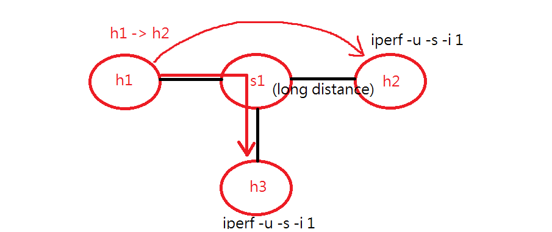
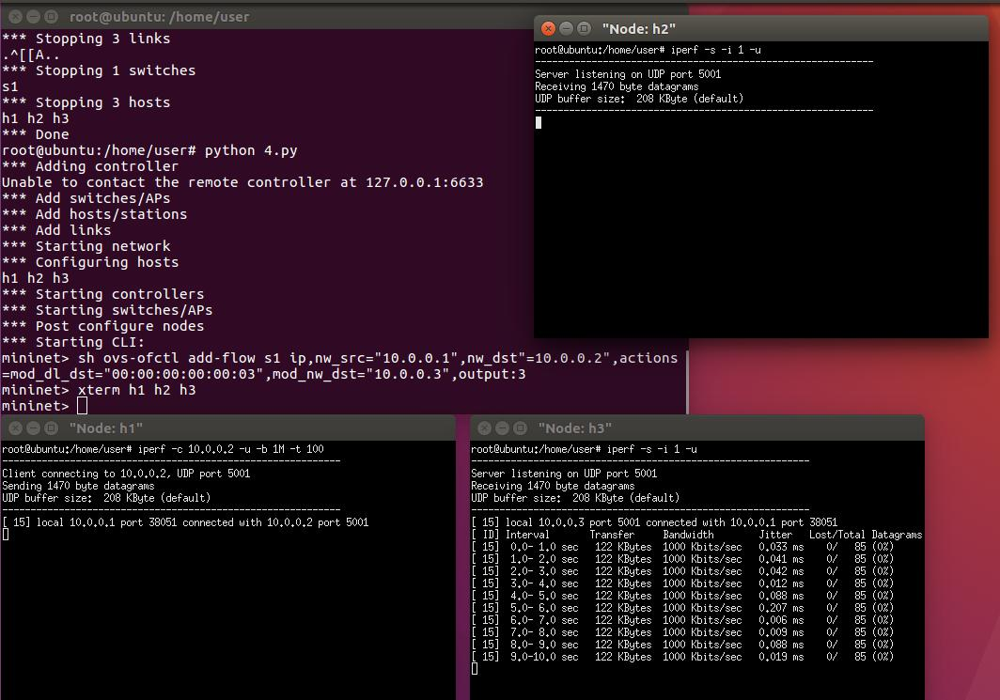
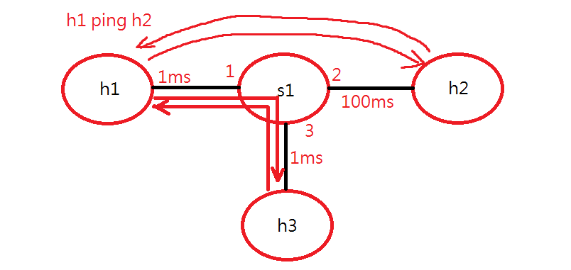
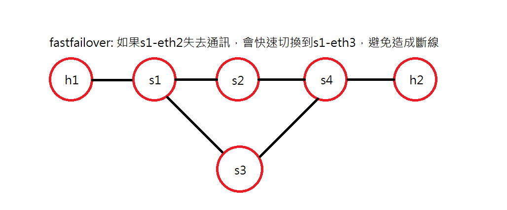
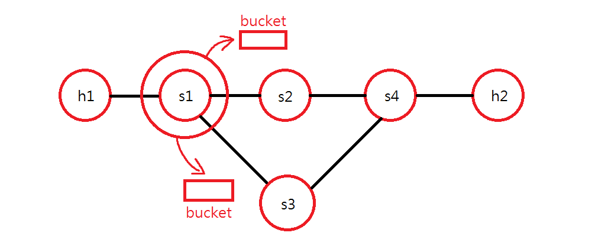

# 0523 第十五週筆記
## SDN
### 範例一-透過DNS更改long distance dst



* 4.py
```
#!/usr/bin/python

from mininet.net import Mininet
from mininet.node import RemoteController, OVSKernelSwitch, Host
from mininet.cli import CLI
from mininet.link import TCLink, Intf
from mininet.log import setLogLevel, info
from subprocess import call


def myNetwork():

    net = Mininet(topo=None,
                       build=False,
                       ipBase='10.0.0.0/8', link=TCLink)

    info( '*** Adding controller\n' )
    c0 = net.addController(name='c0',
                           controller=RemoteController,
                           ip='127.0.0.1',
                           protocol='tcp',
                           port=6633)

    info( '*** Add switches/APs\n')
    s1 = net.addSwitch('s1', cls=OVSKernelSwitch)

    info( '*** Add hosts/stations\n')
    h1 = net.addHost('h1', cls=Host, ip='10.0.0.1/24', mac='00:00:00:00:00:01', defaultRoute=None)
    h2 = net.addHost('h2', cls=Host, ip='10.0.0.2/24', mac='00:00:00:00:00:02', defaultRoute=None)
    h3 = net.addHost('h3', cls=Host, ip='10.0.0.3/24', mac='00:00:00:00:00:03', defaultRoute=None)
    
    info( '*** Add links\n')
    net.addLink(s1, h1, delay='1ms')
    net.addLink(s1, h2, delay='100ms')
    net.addLink(s1, h3, delay='1ms')

    info( '*** Starting network\n')
    net.build()
    info( '*** Starting controllers\n')
    for controller in net.controllers:
        controller.start()

    info( '*** Starting switches/APs\n')
    net.get('s1').start([c0])
    net.get('s1').cmd("ovs-ofctl add-flow s1 priority=1,ip,nw_dst=10.0.0.1,actions=output:1")
    net.get('s1').cmd("ovs-ofctl add-flow s1 priority=1,ip,nw_dst=10.0.0.2,actions=output:2")
    net.get('s1').cmd("ovs-ofctl add-flow s1 priority=1,ip,nw_dst=10.0.0.3,actions=output:3")
    net.get('h1').cmd("arp -s 10.0.0.2 00:00:00:00:00:02")
    net.get('h1').cmd("arp -s 10.0.0.3 00:00:00:00:00:03")
    net.get('h2').cmd("arp -s 10.0.0.1 00:00:00:00:00:01")
    net.get('h2').cmd("arp -s 10.0.0.3 00:00:00:00:00:03")
    net.get('h3').cmd("arp -s 10.0.0.1 00:00:00:00:00:01")
    net.get('h3').cmd("arp -s 10.0.0.2 00:00:00:00:00:02")

    info( '*** Post configure nodes\n')

    CLI(net)
    net.stop()


if __name__ == '__main__':
    setLogLevel( 'info' )
    myNetwork()
```

* 執行指令
```
# python 4.py
mininet> sh ovs-ofctl add-flow s1 ip,nw_src="10.0.0.1",nw_dst"=10.0.0.2",actions=mod_dl_dst="00:00:00:00:00:03",mod_nw_dst="10.0.0.3",output:3
mininet> xterm h1 h2 h3
h2> iperf -s -i 1 -u
h3> iperf -s -i 1 -u
h1> iperf -c 10.0.0.2 -u -b 1M -t 100
```



### 範例二-使h1 ping h2時，h1 h3可雙向溝通



* 執行指令
```
# python 4.py
mininet> sh ovs-ofctl add-flow s1 ip,nw_src="10.0.0.1",nw_dst"=10.0.0.2",actions=mod_dl_dst="00:00:00:00:00:03",mod_nw_dst="10.0.0.3",output:3
mininet> sh ovs-ofctl add-flow s1 ip,nw_dst=10.0.0.1,nw_src=10.0.0.3,actions=mod_nw_src=10.0.0.2,output=1
mininet> xterm h1 h2 h3
h2> tcpdump -i h2-eth0
h3> tcpdump -i h3-eth0
h1> ping 10.0.0.2 -c 3
```

### 範例三-h1 ping h2來回的路徑不同


* 5.py
```
#!/usr/bin/python

from mininet.net import Mininet
from mininet.node import RemoteController, OVSKernelSwitch, Host
from mininet.cli import CLI
from mininet.link import TCLink, Intf
from mininet.log import setLogLevel, info
from subprocess import call


def myNetwork():

    net = Mininet(topo=None,
                       build=False,
                       ipBase='10.0.0.0/8')

    info( '*** Adding controller\n' )
    c0 = net.addController(name='c0',
                           controller=RemoteController,
                           ip='127.0.0.1',
                           protocol='tcp',
                           port=6633)

    info( '*** Add switches/APs\n')
    s3 = net.addSwitch('s3', cls=OVSKernelSwitch)
    s2 = net.addSwitch('s2', cls=OVSKernelSwitch)
    s1 = net.addSwitch('s1', cls=OVSKernelSwitch)

    info( '*** Add hosts/stations\n')
    h1 = net.addHost('h1', cls=Host, ip='10.0.0.1/24', mac="00:00:00:00:00:01", defaultRoute=None)
    h2 = net.addHost('h2', cls=Host, ip='10.0.0.2/24', mac="00:00:00:00:00:02", defaultRoute=None)
   

    info( '*** Add links\n')
    net.addLink(h1, s1)
    net.addLink(h2, s3)
    net.addLink(s1, s2)
    net.addLink(s2, s3)
    net.addLink(s1, s3)

    info( '*** Starting network\n')
    net.build()
    info( '*** Starting controllers\n')
    for controller in net.controllers:
        controller.start()

    info( '*** Starting switches/APs\n')
    net.get('s3').start([c0])
    net.get('s2').start([c0])
    net.get('s1').start([c0])
    net.get('h1').cmd("arp -s 10.0.0.2 00:00:00:00:00:02")
    net.get('h2').cmd("arp -s 10.0.0.1 00:00:00:00:00:01")
    net.get('s1').cmd("ovs-ofctl add-flow s1 ip,nw_src=10.0.0.1,nw_dst=10.0.0.2,actions=output:3")
    net.get('s1').cmd("ovs-ofctl add-flow s1 ip,nw_src=10.0.0.2,nw_dst=10.0.0.1,actions=output:1")
    net.get('s3').cmd("ovs-ofctl add-flow s3 ip,nw_src=10.0.0.1,nw_dst=10.0.0.2,actions=output:1")
    net.get('s3').cmd("ovs-ofctl add-flow s3 ip,nw_src=10.0.0.2,nw_dst=10.0.0.1,actions=output:2")
    net.get('s2').cmd("ovs-ofctl add-flow s2 ip,nw_src=10.0.0.2,nw_dst=10.0.0.1,actions=output:1")
    

    info( '*** Post configure nodes\n')

    CLI(net)
    net.stop()


if __name__ == '__main__':
    setLogLevel( 'info' )
    myNetwork()
```
* 執行指令
```
# python 5.py
mininet> xterm s2 s3
s2> tcpdump -i s2-eth1
s3> tcpdump -i s3-eth3
mininet> h1 ping h2
```


### 範例四-fastfailover



* 6.py
```
from mininet.net import Mininet
from mininet.node import Controller, RemoteController, OVSKernelSwitch, UserSwitch, OVSSwitch
from mininet.cli import CLI
from mininet.log import setLogLevel
from mininet.link import Link, TCLink
 
def topology():
        net = Mininet( controller=RemoteController, link=TCLink, switch=OVSKernelSwitch)

        # Add hosts and switches
        h1= net.addHost( 'h1', mac="00:00:00:00:00:01" )
        h2 = net.addHost( 'h2', mac="00:00:00:00:00:02" )
        s1 = net.addSwitch( 's1', protocols=["OpenFlow10,OpenFlow13"], listenPort=6634 )
        s2 = net.addSwitch( 's2', protocols=["OpenFlow10,OpenFlow13"], listenPort=6635 )
        s3 = net.addSwitch( 's3', protocols=["OpenFlow10,OpenFlow13"], listenPort=6636 )
        s4 = net.addSwitch( 's4', protocols=["OpenFlow10,OpenFlow13"], listenPort=6637 )
        c0 = net.addController( 'c0', controller=RemoteController, ip='127.0.0.1', port=6633 )

        net.addLink( h1, s1)
        net.addLink( h2, s4)
        net.addLink( s1, s2)
        net.addLink( s1, s3)
        net.addLink( s2, s4)
        net.addLink( s3, s4)
        net.build()
        c0.start()
        s1.start( [c0] )
        s2.start( [c0] )
        s3.start( [c0] )
        s4.start( [c0] )
        
        print "*** Running CLI"
        CLI( net )
        print "*** Stopping network"
        net.stop()

if __name__ == '__main__':
    setLogLevel( 'info' )
    topology()   
```

* rule1.sh
```
ovs-ofctl -O OpenFlow13 add-flow s2 in_port=1,actions=output:2
ovs-ofctl -O OpenFlow13 add-flow s2 in_port=2,actions=output:1
ovs-ofctl -O OpenFlow13 add-flow s3 in_port=1,actions=output:2
ovs-ofctl -O OpenFlow13 add-flow s3 in_port=2,actions=output:1
ovs-ofctl -O OpenFlow13 add-flow s4 in_port=2,actions=output:1
ovs-ofctl -O OpenFlow13 add-flow s4 in_port=3,actions=output:1
ovs-ofctl -O OpenFlow13 add-flow s4 in_port=1,actions=output:3
ovs-ofctl -O OpenFlow13 add-flow s1 in_port=2,actions=output:1
ovs-ofctl -O OpenFlow13 add-flow s1 in_port=3,actions=output:1
ovs-ofctl -O OpenFlow13 add-group s1 group_id=4,type=ff,bucket=watch_port:2,output:2,bucket=watch_port:3,output:3
ovs-ofctl -O OpenFlow13 add-flow s1 in_port=1,actions=group:4
```
* 執行指令
```
# chmod +x rule1.sh
# python 6.py
#2 ./rule1.sh
mininet> sh ovs-ofctl -O OpenFlow13 dump-flows s1  ##查看規則
mininet> xterm h1
mininet> sh ovs-ofctl dump-ports s1  ##查看每個埠號接收情形
mininet> xterm h1
h1> ping 10.0.0.2
mininet> link s1 s2 down  ##模擬斷線
mininet> link s1 s2 up  ##模擬連線恢復
```
### [範例六-group-select](http://csie.nqu.edu.tw/smallko/sdn/group-select.htm)



* rule2.sh
```

ovs-ofctl -O OpenFlow13 add-flow s2 in_port=1,actions=output:2
ovs-ofctl -O OpenFlow13 add-flow s2 in_port=2,actions=output:1
ovs-ofctl -O OpenFlow13 add-flow s3 in_port=1,actions=output:2
ovs-ofctl -O OpenFlow13 add-flow s3 in_port=2,actions=output:1
ovs-ofctl -O OpenFlow13 add-flow s4 in_port=2,actions=output:1
ovs-ofctl -O OpenFlow13 add-flow s4 in_port=3,actions=output:1
ovs-ofctl -O OpenFlow13 add-flow s4 in_port=1,actions=output:3
ovs-ofctl -O OpenFlow13 add-flow s1 in_port=2,actions=output:1
ovs-ofctl -O OpenFlow13 add-flow s1 in_port=3,actions=output:1
ovs-ofctl -O OpenFlow13 add-group s1 group_id=5,type=select,bucket=output:2,bucket=output:3
ovs-ofctl -O OpenFlow13 add-flow s1 in_port=1,actions=group:5
```
* 執行指令
```
# python 6.py
#2 ./rule2.sh
```
