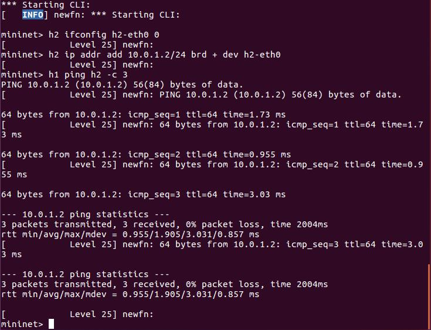
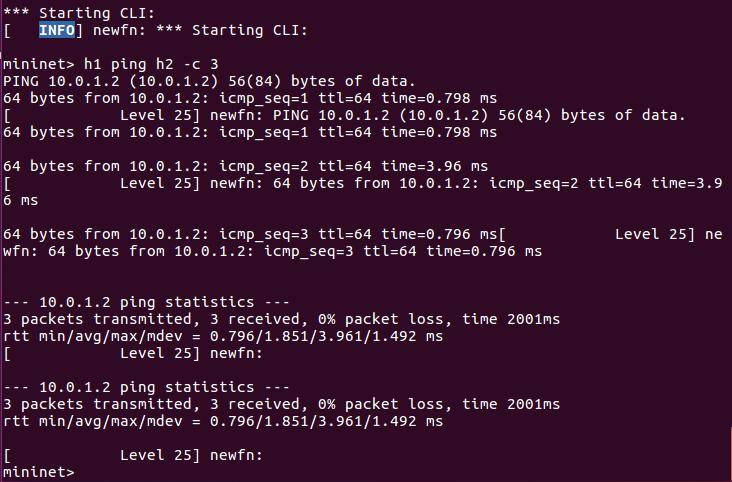

# 0530 第十六週筆記
## SDN第二代-P4
可自己定義表頭、格式，也可以定義封包處理方式。

### 範例一-基本架構


* 執行指令
```
# cd p4-test/1
# p4run
#2 simple_switch_CLI --thrift-port 9090
RuntimeCmd: table_dump phy_forward  ##查看規則
RuntimeCmd: table_delete phy_forward 0  ##刪除第0條規則
RuntimeCmd: table_delete phy_forward 1
mininet> h1 ping h2 -c 3  ##失敗
RuntimeCmd: table_add phy_forward forward 1 => 2  ##手動添加規則
RuntimeCmd: table_add phy_forward forward 2 => 1  ##手動添加規則
mininet> h1 ping h2 -c 3  ##成功


##額外新增規則方法
RuntimeCmd: clear_delete phy_forward
mininet> h1 ping h2 -c 3  ##失敗
# simple_switch_CLI --thrift-port 9090 < cmd.txt
mininet> h1 ping h2 -c 3  ##成功
```
### 範例二


* p4app.json
```
{
  "program": "basic.p4",
  "switch": "simple_switch",
  "compiler": "p4c",
  "options": "--target bmv2 --arch v1model --std p4-16",
  "switch_cli": "simple_switch_CLI",
  "cli": true,
  "pcap_dump": false,
  "enable_log": false,
  "topo_module": {
    "file_path": "",
    "module_name": "p4utils.mininetlib.apptopo",
    "object_name": "AppTopoStrategies"
  },
  "controller_module": null,
  "topodb_module": {
    "file_path": "",
    "module_name": "p4utils.utils.topology",
    "object_name": "Topology"
  },
  "mininet_module": {
    "file_path": "",
    "module_name": "p4utils.mininetlib.p4net",
    "object_name": "P4Mininet"
  },
  "topology": {
    "links": [["h1", "s1"], ["h2", "s2"], ["s1", "s2"]],
    "hosts": {
      "h1": {
      },
      "h2": {
      }
    },
    "switches": {
      "s1": {
        "cli_input": "cmd.txt",
        "program": "basic.p4"
      },
      "s2": {
        "cli_input": "cmd.txt",
        "program": "basic.p4"
      }
    }
  }
}
```

* 執行指令
```
##清空執行檔，重新配置
# cp -r 1 1-a
# cd 1-a
# rm basic.json basic.p4i topology.db

# p4run
##因為自動配置成不同區域網路，所以要清除並重新設置
mininet> h2 ifconfig h2-eth0 0
mininet> h2 ip addr add 10.0.1.2/24 brd + dev h2-eth0
mininet> h1 ping h2 -c 3
```



* p4app.json(不用改IP的方法)
```
{
  "program": "basic.p4",
  "switch": "simple_switch",
  "compiler": "p4c",
  "options": "--target bmv2 --arch v1model --std p4-16",
  "switch_cli": "simple_switch_CLI",
  "cli": true,
  "pcap_dump": false,
  "enable_log": false,
  "topo_module": {
    "file_path": "",
    "module_name": "p4utils.mininetlib.apptopo",
    "object_name": "AppTopoStrategies"
  },
  "controller_module": null,
  "topodb_module": {
    "file_path": "",
    "module_name": "p4utils.utils.topology",
    "object_name": "Topology"
  },
  "mininet_module": {
    "file_path": "",
    "module_name": "p4utils.mininetlib.p4net",
    "object_name": "P4Mininet"
  },
  "topology": {
    "assignment_strategy": "l2",  ##指派策略:第二層
    "links": [["h1", "s1"], ["h2", "s2"], ["s1", "s2"]],
    "hosts": {
      "h1": {
      },
      "h2": {
      }
    },
    "switches": {
      "s1": {
        "cli_input": "cmd.txt",
        "program": "basic.p4"
      },
      "s2": {
        "cli_input": "cmd.txt",
        "program": "basic.p4"
      }
    }
  }
}
```

### 範例三


* 執行指令
```
# cd /home/user/p4-test/2
# p4run
mininet> h1 ping h2 -c 3  ##成功
```


